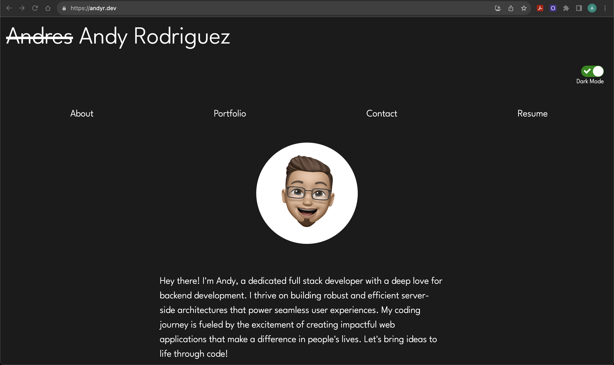
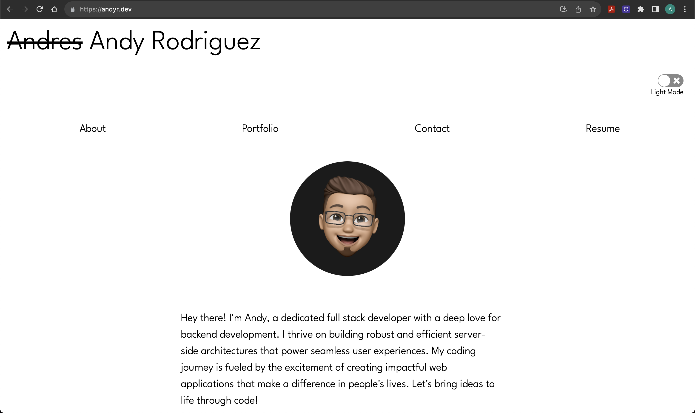

# React Portfolio

  
  
  
  
  
  ## Description
  
  This is my portfolio that was created using REACT. View my recent projects in my portfolio, get in contact with me via email from the contact page, view and download a PDF version of my resume, and toggle between light and dark mode for a better viewing experience!

    

  ## Table of Contents
  
  - [Installation](#installation)
  - [Usage](#usage)
  - [Credits](#credits)
  - [License](#license)

   
  
  ## Installation / Dependencies

      React, NPM, FontAwesome, Bootstrap

  
   

  ## Usage

  Visit the website https://andyr.dev to see my up to date resume! 

   
  
  ## Credits

      Github: andyr-dev Email: andy3942@gmail.com
  
  ## License

  This project is licensed under the [MIT License](https://opensource.org/licenses/MIT) license.
  
   

  ## Badges

    

   
  
  ## Questions

  If you have any questions, please feel free to email me at andy3942@gmail.com

  [Link to my GitHub](https://github.com/andyr-dev/)
  
   

